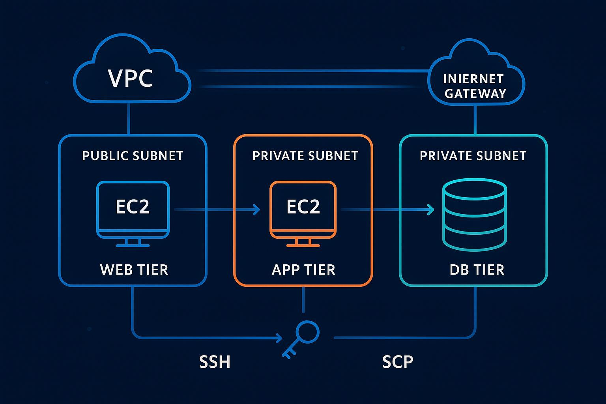
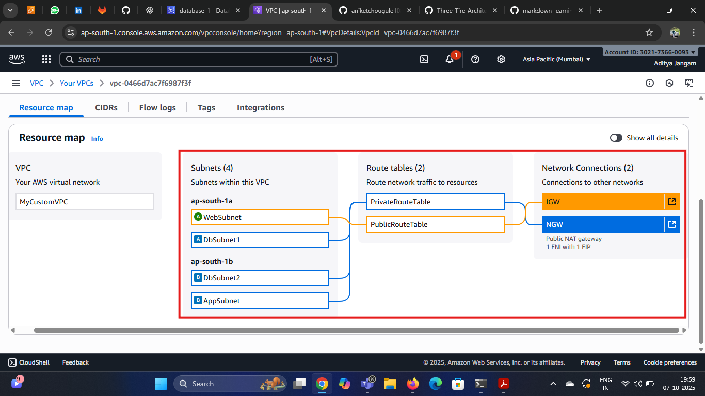
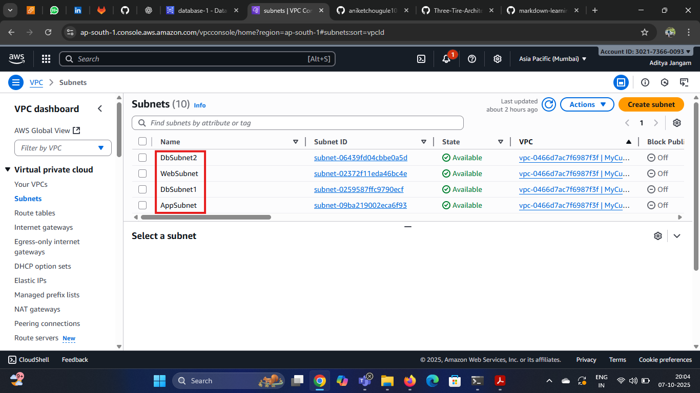
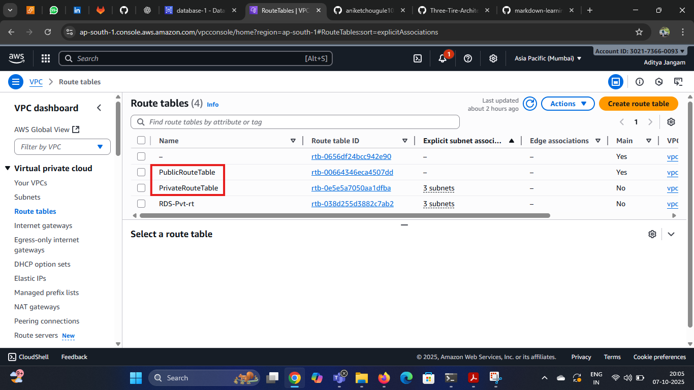
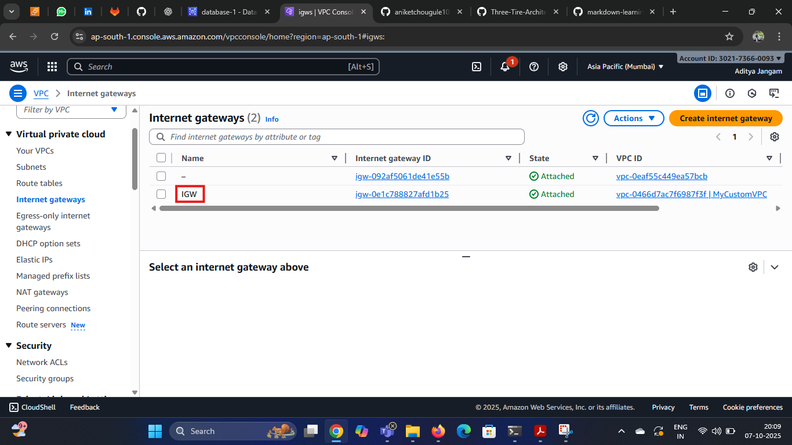
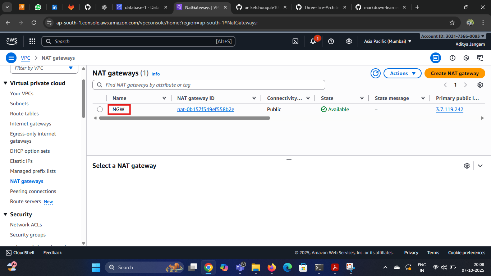
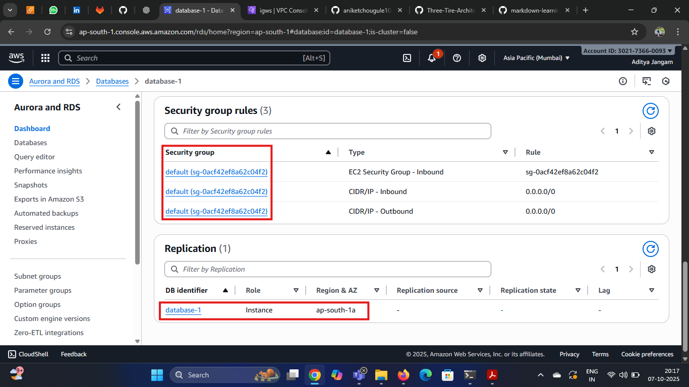
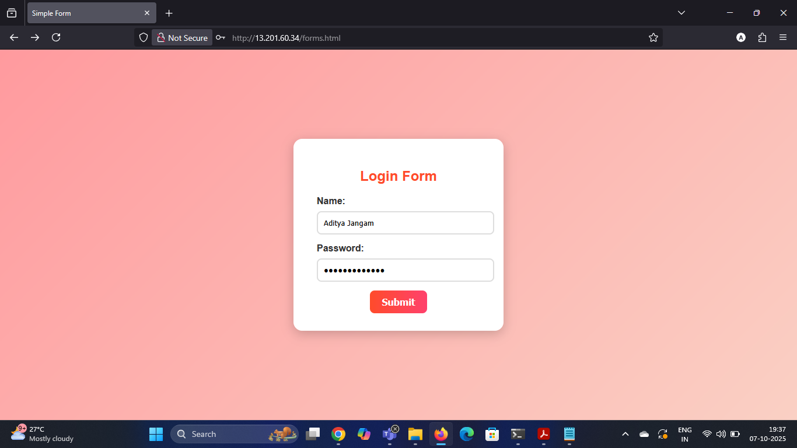
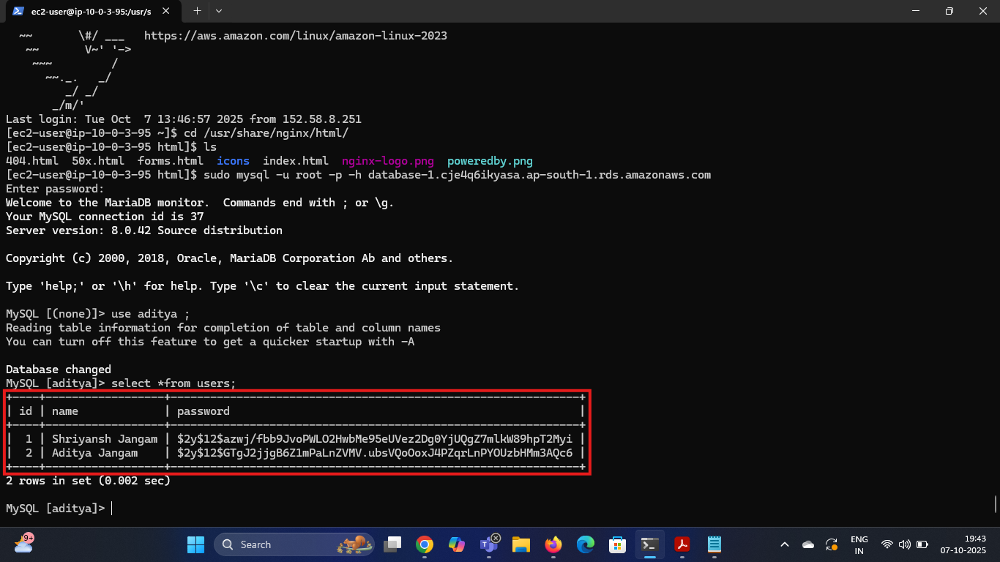

# Three_Tier_Architecture_Deployment 

## Description :
This workshop is a hands-on lab to build a 3-tier Login Page application on AWS. We will manually create the required VPC networking, security groups, application servers, and database components to run this architecture in a scalable, secure and highly available manner.

## Overview :


 In this architecture, client traffic directly hits the Web Tier (EC2 + Nginx). The Web Tier forwards requests to the Application Tier (PHP) which processes the logic and interacts with the RDS MySQL database for data operations. The Application Tier sends back the response to the Web Tier and finally returns the output to the user. Auto Scaling and Health Checks are used to maintain availability of each tier.

### What is a 3 Tier Architecture ?
A 3-tier architecture is a software design model that splits an application into three layers:
* **Web Tier** – This is the user interface (frontend) where users interact with the application.
* **App Tier** – This layer contains the business logic and processes the requests (backend).
* **Data Tier** – This is where the data is stored, managed, and retrieved (database).

This separation makes the application easier to scale, secure, and maintain.

### Benefits of a 3 Tier Architecture
* **Scalability** – Each tier can scale independently based on demand.
* **Security** – Sensitive data stays in the data tier and is not directly exposed to users.
* **Maintainability** – Clear separation of layers makes updates and changes easier.
* **Reusability** – Logic and components in each tier can be reused across multiple apps.
* **Flexibility** – You can change or upgrade one tier without impacting the others.
* **High Availability** – Each layer can have its own redundancy and failover setup to keep the system running.

## Let's Create 👉

 ##  Step 1 - VPC Create 
 

 Built a custom VPC as the backbone of the network.

 ## Step 2 - Create Subnets

Create 4 Subnets - 1 Public Subnet for Web Tier, 3 Private Subnets for DB tier & APP Tier. 

* WebSubnetZoneA-    10.0.0.0/20
* AppSubnetZoneA-    10.0.16.0/20
* DBSubnetZoneA-     10.0.31.0/20
* DBSubnetZoneB-     10.0.48.0/20




## Step 3- Create Route Tables

Create Two Route Tables - Public Route Table and Private Route Table



1. Then Create **Internet Gateway** and Attach to the VPC.



2. Then Create **Nat Gateway** and Attach to the VPC.




## Step 4- Create RDS Database & Configure SG.


Create Database and port number 3306 in Security Group of RDS

### Steps to Create MySQL RDS:
1. Open RDS Console
   *  Go to AWS Console → Search for RDS → Click Create Database.

2. Choose Database Creation Method
   * Select Standard Create.

3. Select Engine
   * Choose MySQL as the database engine.
   * Select the MySQL version you need (latest recommended).

4. Templates
Choose a template.
   * Free Tier (for testing)

5. Settings
   * DB Instance Identifier: e.g., my-mysql-db
   * Master Username: e.g., admin
   * Password: Enter and confirm a strong password.

6. Instance & Storage
   * Choose an Instance class (e.g., db.t3.micro for free tier).
   * Allocate storage (default 20GB).

7. Connectivity
   * Choose your VPC.
   * Decide if the DB should be publicly accessible.
   * Attach a Security Group:
   * Allow inbound traffic on port 3306 (MySQL) from trusted IPs or EC2.

10. Create Database
    * Click Create Database.
    * Wait until status changes to avaliable

## Step 5- Launch Ec2 Instances

 

1. Launch Web Server in Public Subnet 
    * Install nginx and enable
      ```
       sudo yum install nginx -y
       sudo service nginx start
       sudo systemctl enable nginx
      ```
2. Launch App Server in Private Subnet
   * Install Nginx, php and php-mysql connector
   * Start and enable nginx and php-fpm
     ```
     sudo yum install nginx php -y
     sudo service nginx start
     sudo systemctl enable nginx
     sudo service php-fpm start
     sudo systemctl enable php-fpm

     sudo yum install mysql-php8.4.x86_64
     
     ```

## Final Output Images -
1. Login Page



2. Data Insert In Database 


 
## Conclusion

A 3-tier architecture splits an application into three layers: Presentation (Web), Application (Logic), and Database (Storage). Each layer works separately which improves scalability, security, and maintenance. Because every tier can be updated or scaled independently, this model is widely used in cloud platforms like AWS to build stable and modular applications.


